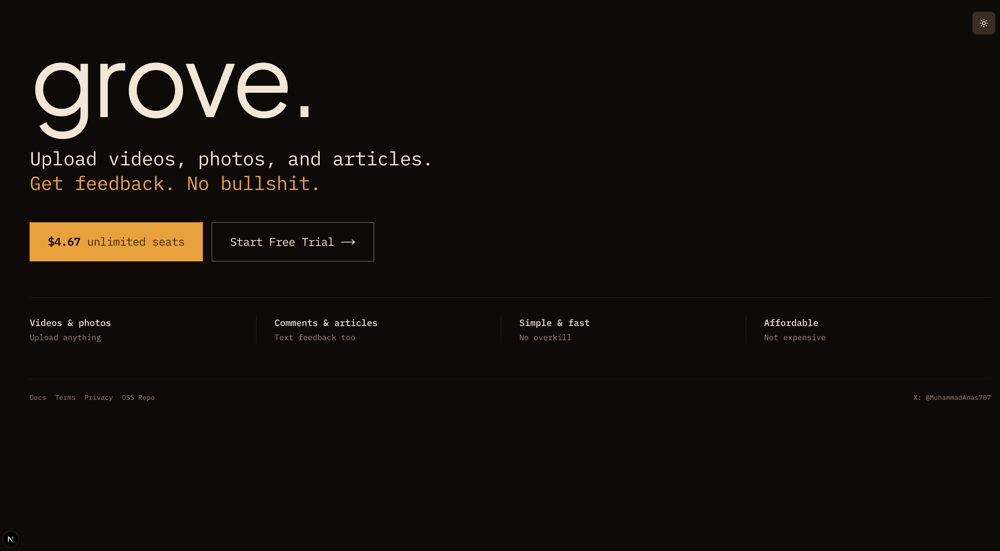

# grove



Open‑source media review workspace for video + photo feedback. Upload assets, share a link, and leave timestamped notes.

## Features
- Project creation + invite links for collaborators
- Video + photo uploads (Convex storage)
- Timestamped notes for video, general notes for photos
- Access gating for active plan or trial

## Tech stack
- Next.js App Router (React 19)
- Convex (database, storage, auth data)
- Auth.js (credentials auth)
- Polar (billing + trial activation)

## Open‑source / self‑hosted setup

### Prereqs
- Node.js 18+ and npm
- A Convex account (free for dev)

### 1) Install deps
```bash
npm install
```

### 2) Configure env
```bash
cp .env.local.example .env.local
```

Then set at least:
- `AUTH_SECRET` (generate with `openssl rand -base64 32`)

### 3) Start Convex
```bash
npx convex dev
```
This writes `NEXT_PUBLIC_CONVEX_URL` and `CONVEX_DEPLOYMENT` into `.env.local`.

### 4) Run the app
```bash
npm run dev
```
App runs on `http://localhost:4000`.

## Local access without Polar (OSS mode)
Billing is optional for self‑hosting, but the app **requires** `subscriptionStatus` to be `active` or `trialing` for full access.

If you’re not using Polar locally:
1. Sign up in the app.
2. Open the Convex dashboard and edit your user record.
3. Set `subscriptionStatus` to `active` (or `trialing`).

## Polar billing (optional / hosted)
Set these in `.env.local` if you want paid plans + trials:
- `POLAR_ACCESS_TOKEN`
- `POLAR_WEBHOOK_SECRET`
- `POLAR_PRODUCT_ID`
- `POLAR_SERVER` (`sandbox` or `production`)
- `POLAR_SUCCESS_URL`
- `POLAR_RETURN_URL`
- `NEXT_PUBLIC_APP_URL`

Then configure the Polar webhook to:
`https://your-domain.com/api/polar/webhook`
Events: `subscription.created`, `subscription.updated`, `subscription.canceled`, `checkout.updated`

## Scripts
```bash
npm run dev
npm run build
npm run start
npm run convex:dev
npm run convex:deploy
```

## Contributing
See `CONTRIBUTING.md`.

## Security
See `SECURITY.md`.

## License
MIT — see `LICENSE`.

## Commercial / hosted offering
This repository is fully open‑source and self‑hostable. A managed hosted version (with billing, maintenance, and support) is also available.

```bash
npm run dev
# or
yarn dev
# or
pnpm dev
# or
bun dev
```

Open [http://localhost:3000](http://localhost:3000) with your browser to see the result.

You can start editing the page by modifying `app/page.tsx`. The page auto-updates as you edit the file.

This project uses [`next/font`](https://nextjs.org/docs/app/building-your-application/optimizing/fonts) to automatically optimize and load [Geist](https://vercel.com/font), a new font family for Vercel.

## Learn More

To learn more about Next.js, take a look at the following resources:

- [Next.js Documentation](https://nextjs.org/docs) - learn about Next.js features and API.
- [Learn Next.js](https://nextjs.org/learn) - an interactive Next.js tutorial.

You can check out [the Next.js GitHub repository](https://github.com/vercel/next.js) - your feedback and contributions are welcome!

## Deploy on Vercel

The easiest way to deploy your Next.js app is to use the [Vercel Platform](https://vercel.com/new?utm_medium=default-template&filter=next.js&utm_source=create-next-app&utm_campaign=create-next-app-readme) from the creators of Next.js.

Check out our [Next.js deployment documentation](https://nextjs.org/docs/app/building-your-application/deploying) for more details.
